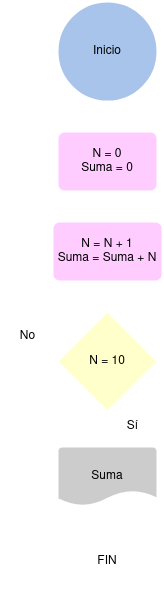

# Ejercicios

- [Ejercicio 1](#ejercicio1)
- [Ejercicio 2](#ejercicio2)
- [Ejercicio 3](#ejercicio3)

## Ejercicio 1 
Desarrolle un algoritmo que permita leer dos valores distintos, determinar cual de los dos valores es el mayor y escribirlo.

### Diagrama de Flujo

### Pseudocódigo

Pasos:

- __Inicio__
- __Inicializar__ variables: __A = 0, B = 0__
- Solicitar la __introducción__ de __dos valores__ distintos
- __Leer__ los __dos__ valores
- Asignarlos a las __variables A y B__
- Si __A = B__ Entonces __vuelve a 3__ porque los valores __deben ser distintos__
- Si __A>B__ Entonces Escribir __A, “Es el mayor”__
- De lo __contrario__: Escribir __B, “Es el mayor”__
- Fin_Si
- __Fin__

## Ejercicio 2 
Desarrolle un algoritmo que permita leer tres valores y almacenarlos en las variables A, B y C respectivamente. El algoritmo debe imprimir cual es el mayor y cual es el menor. Recuerde constatar que los tres valores introducidos por el teclado sean valores distintos. Presente un mensaje de alerta en caso de que se detecte la introducción de valores iguales.

### Diagrama de Flujo

### Pseudocódigo
- __Inicio__
- __Inicializar__ las variables __A, B y C__
- __Leer__ los __tres valores__
- __Almacenar__ en las variables __A, B y C__
- Si __A > B y A > C__ Entonces
- Escribir __A “Es el mayor”__
- __Sino__
- Si __B > A y B > C__ Entonces
- Escribir __B “Es el mayor”__
- Sino
- Escribir __C “Es el mayor”__
- __Fin_Si__
- __Fin_Si__
- __Fin__

## Ejercicio 3 
Desarrolle un algoritmo que realice la sumatoria de los números enteros comprendidos entre el 1 y el 10, es decir, 1 + 2 + 3 + …. + 10.

### Diagrama de Flujo

### Pseudocódigo
- __Inicio__
- __Declaración de variables__: N= 0, Suma = 0
- __Asignación Contador__ : N = N + 1
- __Asignación Acumulador__: Suma = Suma + N
- __Si__ N = 10 __Entonces__
- __Escribir Suma__
- __De lo contrario__, __Repetir__ desde el paso 3
- __Fin_Si__
- __Fin__

