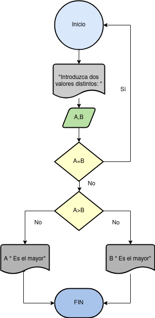

# Ejercicios

- [Ejercicio 1](#ejercicio1)
- [Ejercicio 2](#ejercicio2)
- [Ejercicio 3](#ejercicio3)

## Ejercicio 1 
Desarrolle un algoritmo que permita leer dos valores distintos, determinar cual de los dos valores es el mayor y escribirlo.

### Diagrama de Flujo

### Pseudocódigo

Pasos:

- __Inicio__
- __Inicializar__ variables: A = 0, B = 0
- __Solicitar la introducción__ de dos valores distintos
- __Leer__ los dos valores
- __Asignarlos__ a las variables A y B
- __Si__ A = B __Entonces__ vuelve a 3 porque los valores deben ser distintos
- __Si__ A>B __Entonces__ __Escribir__ A, “Es el mayor”
- __De lo contrario__: __Escribir__ B, “Es el mayor”
- __Fin_Si__
- __Fin__

## Ejercicio 2 
Desarrolle un algoritmo que permita leer tres valores y almacenarlos en las variables A, B y C respectivamente. El algoritmo debe imprimir cual es el mayor y cual es el menor. Recuerde constatar que los tres valores introducidos por el teclado sean valores distintos. Presente un mensaje de alerta en caso de que se detecte la introducción de valores iguales.

### Diagrama de Flujo

### Pseudocódigo
- __Inicio__
- __Inicializar__ las variables A, B y C
- __Leer__ los tres valores
- __Almacenar__ en las variables A, B y C
- __Si__ A > B y A > C __Entonces__
- __Escribir__ A “Es el mayor”
- __Sino__
- __Si__ B > A y B > C __Entonces__
- __Escribir__ B “Es el mayor”
- __Sino__
- __Escribir__ C “Es el mayor”
- __Fin_Si__
- __Fin_Si__
- __Fin__

## Ejercicio 3 
Desarrolle un algoritmo que realice la sumatoria de los números enteros comprendidos entre el 1 y el 10, es decir, 1 + 2 + 3 + …. + 10.

### Diagrama de Flujo

### Pseudocódigo
- __Inicio__
- __Declaración de variables__: N= 0, Suma = 0
- __Asignación Contador__ : N = N + 1
- __Asignación Acumulador__: Suma = Suma + N
- __Si__ N = 10 __Entonces__
- __Escribir Suma__
- __De lo contrario__, __Repetir__ desde el paso 3
- __Fin_Si__
- __Fin__

