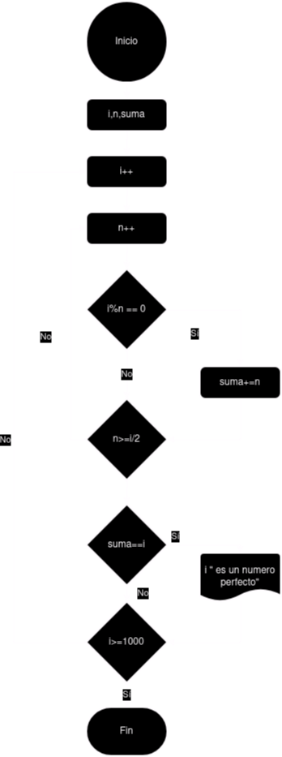

# Tarea 2

## Ejercicio 

### Descripción del ejercicio
Un número perfecto es aquel que es igual a la suma de sus divisores propios (excluyendo él mismo). Por ejemplo, 6 es un número perfecto porque sus divisores propios son 1, 2 y 3, y 1 + 2 + 3 = 6.
El ejercicio consiste en escribir un programa que encuentre e imprima todos los números perfectos en un rango dado (por ejemplo, entre 1 y 1000).
    
### Diagrama de flujos

### Pseudocódigo
- __Inicio__
- __Declaramos__ i, n, suma
- __Incrementamos i__
- __Incrementamos n__
- __Si__ i%n == 0 __Entonces__
- suma+=n
- __Sino__
- __Si__ n>=i/2 __Entonces__
- __Si__ suma==i __Entonces__
- __Imprimir__ i " es un numero perfecto"
- __Sino__
- __Si__ i>= 1000 __Entonces__
- __Fin__
- __Sino__
- Volver al incremento de i
- __Sino__
- Volver al __incremento de n__
- __Fin__

### Código en JAVA
- [Click Aquí](src/main/java/ejercicio2.java)

