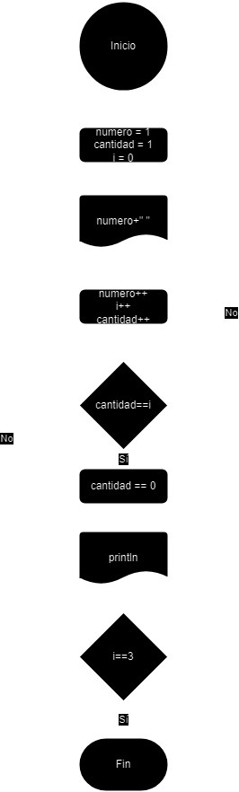
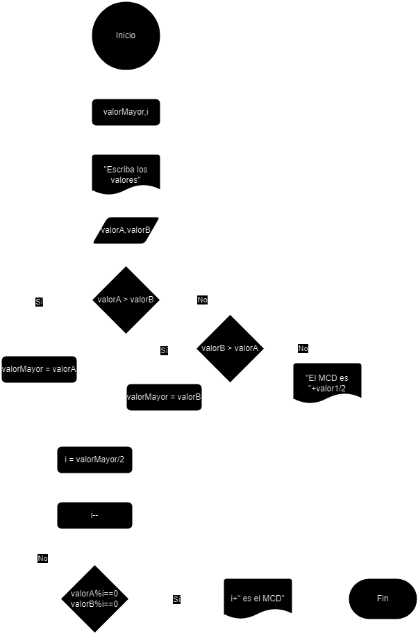
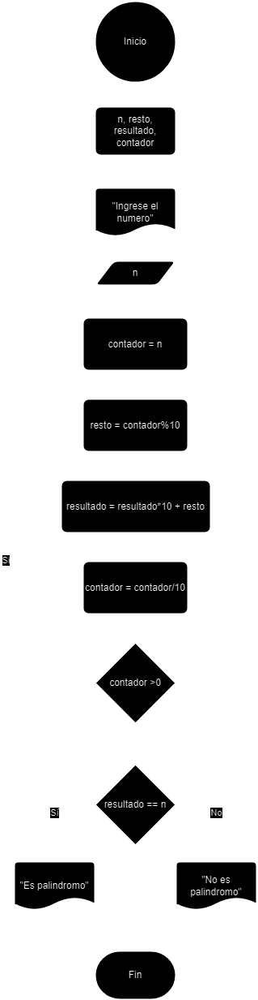
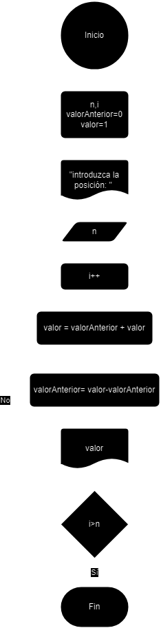
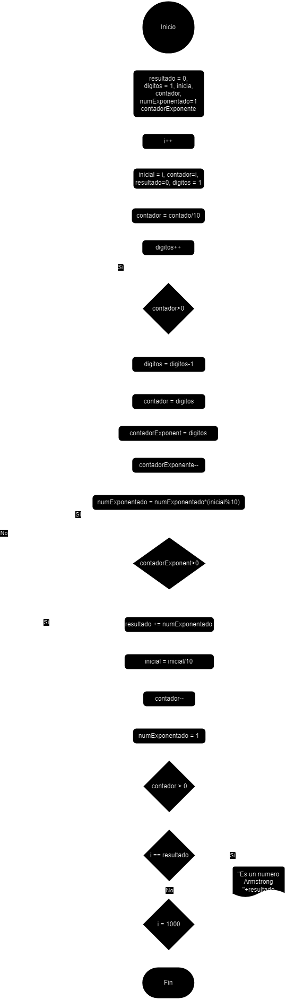
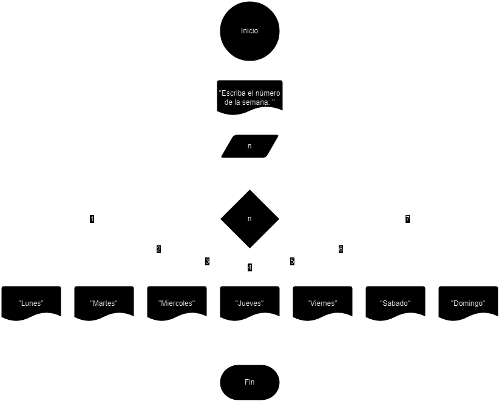
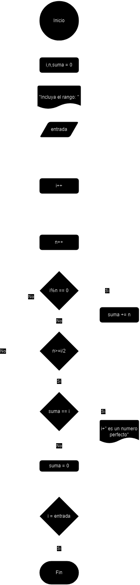
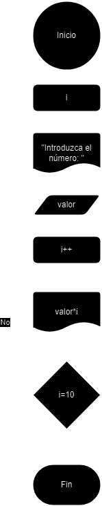
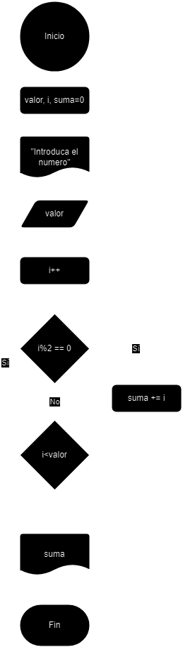

<div align="justify">

# Tarea (3) . Bucles y Condiciones

## Ejercicio 1

### Descripción del ejercicio
 Escribe un programa en Java que imprima el patrón siguiente:
```code
1 
2 3 
4 5 6 
7 8 9 10 
```
### Diagrama de flujos

<div align="center">

</div>

### Pseudocódigo
1. __Inicio__


2. __Declaramos__ variables numero, cantidad, i
3. __Imprimimos__ la variable numero
4. __Incrementamos__ la variable numero, i y cantidad
5. __Si__ cantidad == i __Entonces__
6. cantidad == 0
7. __Imprimimos__ una linea vacia
8. __Sino__
9. Volvemos al paso 3
10. __Si__ i == 3 __Entonces__
11. __Fin_Si__
12. __Sino__
13. Volvemos al paso 3
0. __Fin__

### Código en JAVA
- [Click Aquí](src/main/java/Ejercicio1.java)


## Ejercicio 2

### Descripción del ejercicio
Escribe un programa en Java que encuentre el máximo común divisor (MCD) de dos números. Se debe solicitar los números por teclado.
    
### Diagrama de flujos

<div align="center">

</div>

### Pseudocódigo
1. __Inicio__

2. __Declaramos__ valorMayor e i
3. __Pedimos__ que intruduzca los valores valorA y valorB
4. __Si__ valorA>valorB __Entonces__
5. valorMayor == valorA
6. __Sino__
0. __Si__ valorB>valorA __Entonces__
7. valorMayor = valorB
8. __Sino__ 
9. __Imprimimos__ que el MCD es valor1/2
10. i = valorMayor/2
11. i--
12. __Si__ valorA%i=0 y valorB%i=0 __Entonces__
13. __Imprimimos__ que el MCD es i
14. __Fin_Si__
15. __Sino__
16. Volvemos al paso 11
0. __Fin__

### Código en JAVA
- [Click Aquí](src/main/java/Ejercicio2.java)


## Ejercicio 3

### Descripción del ejercicio
Escribe un programa en Java que encuentre el número de Fibonacci en la posición n.  Se debe solicitar el número por teclado.
    
    
### Diagrama de flujos

<div align="center">

</div>

### Pseudocódigo
1. __Inicio__

2. __Declaramos__ las variables n, i , valorAnterior = 0, valor = 1
3. __Pedimos__ el valor n
4. __Incrementamos__ el valor de i
5. valor = valorAnterior + valor
6. valorAnterior = valor - valorAnterior
7. __Si__ i>n __Entonces__
8. __Imprimimos__ valor
9. __Fin_Si__
10. __Sino__
11. Volvemos al paso 4
0. __Fin__

### Código en JAVA
- [Click Aquí](src/main/java/Ejercicio3.java)


## Ejercicio 4

### Descripción del ejercicio
Escribe un programa en Java que verifique si un número es palíndromo. Se debe solicitar el número por teclado.
    
    
### Diagrama de flujos

<div align="center">

</div>

### Pseudocódigo
1. __Inicio__

2. __Declaramos__ n, resto, resultado, contador
3. __Pedimos__ n
4. contador = n
5. resto = contador%10
6. resultado = resultado*10 + resto
7. contador = contador/10
8. __Si__ contador>0 __Entonces__
9. Volvemos al paso 5
10. __Sino__
11. __Si__ resultado == n __Entonces__
12. __Imprimimos__ que es palindromo
13. __Fin_Si__
14. __Sino__
15. __Imprimimos__ que no es palindromo
0. __Fin__

### Código en JAVA
- [Click Aquí](src/main/java/Ejercicio4.java)


## Ejercicio 5

### Descripción del ejercicio
Escribe un programa en Java que imprima los primeros n términos de la secuencia de Fibonacci. Se debe solicitar el número n por teclado.

### Diagrama de flujos

<div align="center">

</div>

### Pseudocódigo
1. __Inicio__

2. __Declaramos__ las variables n, i , valorAnterior = 0, valor = 1
3. __Pedimos__ el valor n
4. __Incrementamos__ el valor de i
5. valor = valorAnterior + valor
6. valorAnterior = valor - valorAnterior
7. __Imprimimos__ valor
7. Si i>n Entonces
9. Fin_Si
10. __Sino__
11. Volvemos al paso 4
0. __Fin__


### Código en JAVA
- [Click Aquí](src/main/java/Ejercicio5.java)


## Ejercicio 6

### Descripción del ejercicio
Escribe un programa en Java que encuentre todos los números Armstrong entre 1 y 1000.

### Diagrama de flujos

<div align="center">

</div>

### Pseudocódigo
1. __Inicio__

2. __Declaramos__ resultado = 0, digitos = 1, inicial, contador, numExponentado = 1, contadoExponente
3. __Incrementamos__ i
4. __Reseteamos__ valores: inicial = i, contador = i, resultado = 0, digitos = 0
5. contador = contado/10
6. __Incrementamos__ digitos
7. __Si__ contador>0 __Entonces__
8. Volvemos al paso 5
9. __Sino__
10. contador = digitos
11. contadorExponente = digitos
12. __Decrementamos__ contadorExponente
13. numExponentado = numExponentado*(inicial/10)
14. __Si__ contadorExponente >0 __Entonces__
15. Volvemos al paso 12
16. __Sino__
17. resultado += numExponentado
18. inicial = inicial/10
19. __Decrementamos__ contador
20. numExponentado = 1
21. __Si__ contador > 0 __Entonces__
22. Volvemos al paso 11
23. __Sino__
24. __Si__ i == resultado __Entonces__
25. __Imprimimos__ que el resultado es un numero armstrong
26. __Sino__
27. __Si__ i <= 1000 __Entonces__
28. Volvemos al paso 3
29. __Sino__
0. __Fin__


### Código en JAVA
- [Click Aquí](src/main/java/Ejercicio6.java)


## Ejercicio 7

### Descripción del ejercicio
Imprimir el nombre del día de la semana correspondiente a un número ingresado por el usuario utilizando una estructura switch. El día a verificar se debe de pedir por teclado.

### Diagrama de flujos

<div align="center">

</div>

### Pseudocódigo
1. __Inicio__

2. __Pedimos__ que introduzca n
3. __Depende__ de n:
4. Caso n=1
5. __Imprimir__ "Lunes"
4. Caso n=2
5. __Imprimir__ "Martes"
4. Caso n=3
5. __Imprimir__ "Miércoles"
4. Caso n=4
5. __Imprimir__ "Jueves"
4. Caso n=5
5. __Imprimir__ "Viernes"
4. Caso n=6
5. __Imprimir__ "Sábado"
4. Caso n=7
5. __Imprimir__ "Domingo"
0. __Fin__

### Código en JAVA
- [Click Aquí](src/main/java/Ejercicio7.java)


## Ejercicio 8

### Descripción del ejercicio
Encontrar y mostrar todos los números perfectos en un rango dado utilizando un bucle for. Solicita el límite por teclado.


### Diagrama de flujos

<div align="center">

</div>

### Pseudocódigo
1. __Inicio__

2. __Declaramos__ i, n , suma = 0
3. __Pedimos__ entrada
5. __Incrementamos__ i
7. __Incrementamos__ n
8. __Si__ i%n == 0 __Entonces__
9. suma += n
10. __Fin_Si__
11. __Sino__
12. __Si__ n >= i/2 __Entonces__
13. __Si__ suma == i __Entonces__
14. __Imprimimos__ que i es un numero perfecto
15. __Fin_Si__
15. __Sino__
16. Volvemos a paso 7
17. __Sino__
18. suma = 0
19. __Si__ i = entrada __Entonces__
20. __Fin_Si__
21. __Sino__
22. Volvemos a paso 5
0. __Fin__

### Código en JAVA
- [Click Aquí](src/main/java/Ejercicio8.java)


## Ejercicio 9

### Descripción del ejercicio
Imprimir la tabla de multiplicar de un número ingresado por el usuario utilizando un bucle for. Solicita el valor de la tabla por teclado.


### Diagrama de flujos

<div align="center">

</div>

### Pseudocódigo
1. __Inicio__

2. __Declaramos__ i
3. __Pedimos__ valor
4. __Incrementamos__ i
5. __Imprimimos__ valor*i
6. __Si__ i == 10 __Entonces__
7. __Fin_Si__
8. __Sino__
9. Volvemos al paso 4
0. __Fin__

### Código en JAVA
- [Click Aquí](src/main/java/Ejercicio9.java)


## Ejercicio 10

### Descripción del ejercicio
Calcular la suma de todos los números pares entre 1 y un número ingresado por el usuario utilizando un bucle do-while.


### Diagrama de flujos

<div align="center">

</div>

### Pseudocódigo
1. __Inicio__

2. __Declaramos__ valor, i, suma = 0
3. __Pedimos__ valor
4. __Incrementamos__ i
5. __Si__ i%2 == 0 __Entonces__
6. suma += i
7. __Fin_Si__
8. S__ino
9. __Si__ i < valor __Entonces__
10. Volvemos al paso 4
11. __Sino__
12. __Imprimimos__ suma
0. __Fin__

### Código en JAVA
- [Click Aquí](src/main/java/Ejercicio10.java)

</div>