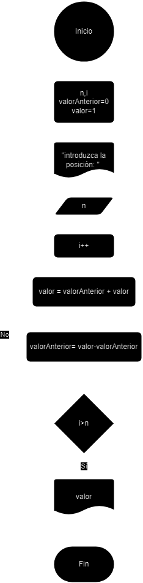
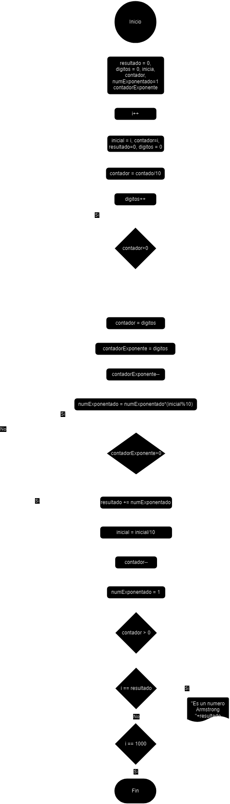

<div align="justify">

# Tarea (3) . Bucles y Condiciones

## Ejercicio 1

### Descripción del ejercicio
 Escribe un programa en Java que imprima el patrón siguiente:
```code
1 
2 3 
4 5 6 
7 8 9 10 
```
### Diagrama de flujos

<div align="center">

</div>

### Pseudocódigo
1. __Inicio__
2. __Declaramos__ variables numero, cantidad, i
3. __Imprimimos__ la variable numero
4. __Incrementamos__ la variable numero, i y cantidad
5. __Si__ cantidad == i __Entonces__
6. cantidad == 0
7. __Imprimimos__ una linea vacia
8. __Sino__
9. Volvemos al paso 3
10. __Si__ i == 3 __Entonces__
11. __Fin_Si__
12. __Sino__
13. Volvemos al paso 3
0. __Fin__

### Código en JAVA
- [Click Aquí](src/main/java/Ejercicio1.java)
</div>


## Ejercicio 2

### Descripción del ejercicio
Escribe un programa en Java que encuentre el máximo común divisor (MCD) de dos números. Se debe solicitar los números por teclado.
    
### Diagrama de flujos

<div align="center">

</div>

### Pseudocódigo
1. __Inicio__
2. __Declaramos__ valorMayor e i
3. __Pedimos__ que intruduzca los valores valorA y valorB
4. __Si__ valorA>valorB __Entonces__
5. valorMayor == valorA
6. __Sino__
0. __Si__ valorB>valorA __Entonces__
7. valorMayor = valorB
8. __Sino__ 
9. __Imprimimos__ que el MCD es valor1/2
10. i = valorMayor/2
11. i--
12. __Si__ valorA%i=0 y valorB%i=0 __Entonces__
13. __Imprimimos__ que el MCD es i
14. __Fin_Si__
15. __Sino__
16. Volvemos al paso 11
0. __Fin__

### Código en JAVA
- [Click Aquí](src/main/java/Ejercicio2.java)
</div>


## Ejercicio 3

### Descripción del ejercicio
Escribe un programa en Java que encuentre el número de Fibonacci en la posición n.  Se debe solicitar el número por teclado.
    
    
### Diagrama de flujos

<div align="center">

</div>

### Pseudocódigo
1. __Inicio__
2. __Declaramos__ las variables n, i , valorAnterior = 0, valor = 1
3. __Pedimos__ el valor n
4. __Incrementamos__ el valor de i
5. valor = valorAnterior + valor
6. valorAnterior = valor - valorAnterior
7. __Si__ i>n __Entonces__
8. __Imprimimos__ valor
9. __Fin_Si__
10. __Sino__
11. Volvemos al paso 4
0. __Fin__

### Código en JAVA
- [Click Aquí](src/main/java/Ejercicio3.java)
</div>


## Ejercicio 4

### Descripción del ejercicio
Escribe un programa en Java que verifique si un número es palíndromo. Se debe solicitar el número por teclado.
    
    
### Diagrama de flujos

<div align="center">

</div>

### Pseudocódigo
1. __Inicio__
2. __Declaramos__ n, resto, resultado, contador
3. __Pedimos__ n
4. contador = n
5. resto = contador%10
6. resultado = resultado*10 + resto
7. contador = contador/10
8. __Si__ contador>0 __Entonces__
9. Volvemos al paso 5
10. __Sino__
11. __Si__ resultado == n __Entonces__
12. __Imprimimos__ que es palindromo
13. __Fin_Si__
14. __Sino__
15. __Imprimimos__ que no es palindromo
0. __Fin__

### Código en JAVA
- [Click Aquí](src/main/java/Ejercicio4.java)
</div>


## Ejercicio 5

### Descripción del ejercicio
Escribe un programa en Java que imprima los primeros n términos de la secuencia de Fibonacci. Se debe solicitar el número n por teclado.

### Diagrama de flujos

<div align="center">

</div>

### Pseudocódigo
1. __Inicio__
2. __Declaramos__ las variables n, i , valorAnterior = 0, valor = 1
3. __Pedimos__ el valor n
4. __Incrementamos__ el valor de i
5. valor = valorAnterior + valor
6. valorAnterior = valor - valorAnterior
7. __Imprimimos__ valor
7. Si i>n Entonces
9. Fin_Si
10. __Sino__
11. Volvemos al paso 4
0. __Fin__
### Código en JAVA
- [Click Aquí](src/main/java/Ejercicio5.java)
</div>


## Ejercicio 6

### Descripción del ejercicio
Escribe un programa en Java que encuentre todos los números Armstrong entre 1 y 1000.

### Diagrama de flujos

<div align="center">

</div>

### Pseudocódigo
1. __Inicio__

0. __Fin__
### Código en JAVA
- [Click Aquí](src/main/java/Ejercicio6.java)
</div>