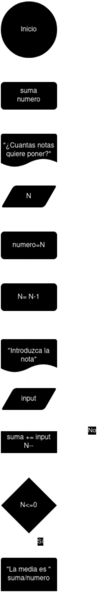

# Tarea 2

## Ejercicio 8

### Descripción del ejercicio
Desarrolle un algoritmo que permita calcular Promedio de Notas; finaliza cuando  N= 0
    
### Diagrama de flujos

### Pseudocódigo
- __Inicio__
- __Declaramos__ suma, numero
- __Preguntamos__ cuantas notas quiere poner (N)
- __Declaramos__ que numero es igual a N
- Le pedimos que __inttroduzca__ la nota (input)
- __Sumamos__ a suma su valor mas el de input
- __Decrementamos__ el valor de N
- __Si__ N<=0 __Entonces__
- __Imprimimos__ la media que es suma/numero
- __Sino__
- __Volvemos__ al paso en el que pedimos la nota
- __Fin__

### Código en JAVA
- [Click Aquí](src/main/java/Ejercicio8.java)

