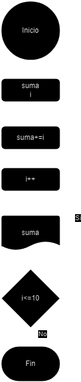
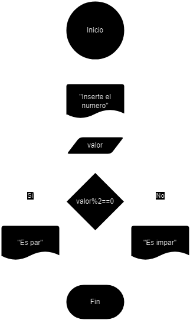
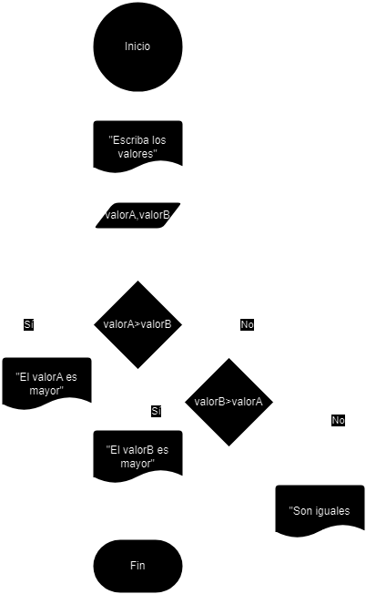

# Tarea 2

## Ejercicio 2

### Descripción del ejercicio
Desarrolle un algoritmo que permita leer tres valores y almacenarlos en las variables A, B y C respectivamente. El algoritmo debe imprimir cual es el mayor y cual es el menor. Recuerde constatar que los tres valores introducidos por el teclado sean valores distintos. Presente un mensaje de alerta en caso de que se detecte la introducción de valores iguales.

### Diagrama de flujos

### Pseudocódigo
- __Inicio__
- __Inicializar__ las variables A, B y C
- __Leer__ los tres valores
- __Almacenar__ en las variables A, B y C
- __Si__ A > B y A > C __Entonces__
- __Escribir__ A “Es el mayor”
- __Sino__
- __Si__ B > A y B > C __Entonces__
- __Escribir__ B “Es el mayor”
- __Sino__
- __Escribir__ C “Es el mayor”
- __Fin_Si__
- __Fin_Si__
- __Fin__

### Código en JAVA
- [Click Aquí](src/main/java/Ejercicio2.java)

## Ejercicio 3

### Descripción del ejercicio

### Diagrama de flujos

### Pseudocódigo
- __Inicio__
- __Declaramos__ variables: suma, i
- suma = suma + i
- __Incremento__ de i
- __Imprimimos__ suma
- __Si__ i<=10 __Entonces__
- __Volvemos__ a suma = suma + i
- __Sino__
- __Fin__

### Código en JAVA

- [Click Aquí](src/main/java/Ejercicio3.java)

## Ejercicio 4

### Descripción del ejercicio

### Diagrama de flujos

### Pseudocódigo
- __Inicio__
- __Imprimir__ "Inserte el numero"
- __Declaramos__ valor
- __Si__ valor%2==0 __Entonces__
- __Imprimir__ "Es par"
- __Sino__ "Es impar
- __Fin_Si__
- __Fin_No__
- __Fin__

### Código en JAVA
- [Click Aquí](src/main/java/Ejercicio4.java)

## Ejercicio 5

### Descripción del ejercicio

### Diagrama de flujos

### Pseudocódigo
- __Inicio__
- __Pedimos__ los valores
- __Declaramos__ valorA,valorB
- __Si__ valorA>valorB __Entonces__
- __Imprimimos__ "El valorA es mayor"
- __Fin_Si__
- __Sino__
- __Si__ valorB>valorA __Entonces__
- __Imprimimos__ "El valorB es mayor"
- __Fin_Si__
- __Sino__
- __Imprimimos__ "Son iguales"
- __Fin_No__
- __Fin__

### Código en JAVA
- [Click Aquí](src/main/java/Ejercicio5.java)

## Ejercicio 6

### Descripción del ejercicio

### Diagrama de flujos

### Pseudocódigo
- __Inicio__

- __Fin__

### Código en JAVA
- [Click Aquí](src/main/java/Ejercicio6.java)

## Ejercicio 7

### Descripción del ejercicio

### Diagrama de flujos

### Pseudocódigo
- __Inicio__

- __Fin__

### Código en JAVA
- [Click Aquí](src/main/java/Ejercicio7.java)

## Ejercicio 8

### Descripción del ejercicio

### Diagrama de flujos

### Pseudocódigo
- __Inicio__

- __Fin__

### Código en JAVA
- [Click Aquí](src/main/java/Ejercicio8.java)

## Ejercicio 9

### Descripción del ejercicio

### Diagrama de flujos

### Pseudocódigo
- __Inicio__

- __Fin__

### Código en JAVA
- [Click Aquí](src/main/java/Ejercicio9.java)

