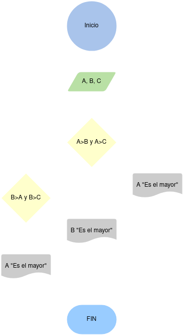

# Título tarea

<!-- Recuerda que

## 1. Subtítulo tarea

### 1.1 Subtítulo de la tarea

-- Incluir imagenes

     

-->

## Descripción del ejercicio
Desarrolle un algoritmo que permita leer tres valores y almacenarlos en las variables A, B y C respectivamente. El algoritmo debe imprimir cual es el mayor y cual es el menor. Recuerde constatar que los tres valores introducidos por el teclado sean valores distintos. Presente un mensaje de alerta en caso de que se detecte la introducción de valores iguales.

## Diagrama de flujos

## Pseudocódigo
- __Inicio__
- __Inicializar__ las variables A, B y C
- __Leer__ los tres valores
- __Almacenar__ en las variables A, B y C
- __Si__ A > B y A > C __Entonces__
- __Escribir__ A “Es el mayor”
- __Sino__
- __Si__ B > A y B > C __Entonces__
- __Escribir__ B “Es el mayor”
- __Sino__
- __Escribir__ C “Es el mayor”
- __Fin_Si__
- __Fin_Si__
- __Fin__

## Referencias

