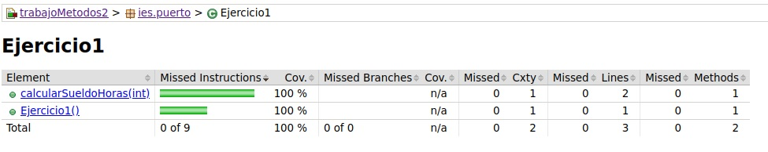
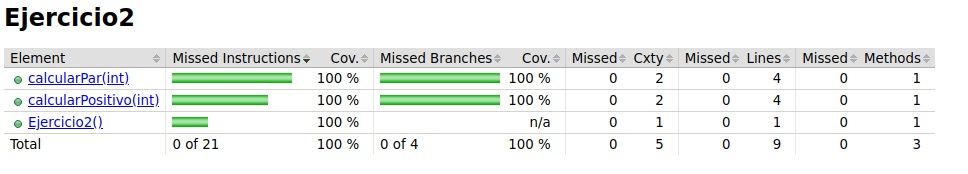
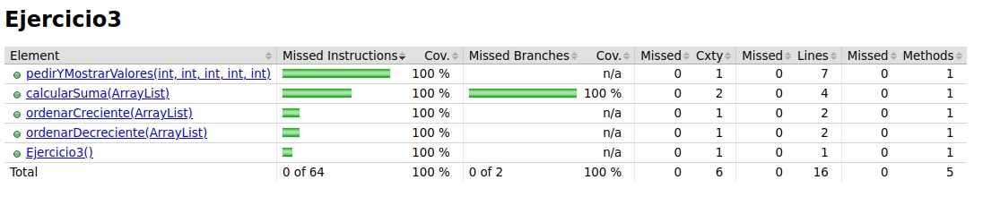

<div align = "Justify">


# Tarea Metodos Dos Jonay Contreras

## Ejercicio 1


 <details>
 <summary>Pseudocódigo</summary>

1. __Declaramos__ que el sueldo es __igual__ al numero de horas __por__ diez
2. __Devolvemos__ el sueldo

</details>

<details>
<summary>Código en JAVA</summary>


### Ejercicio

```java
package ies.puerto;
/**
 * Realizar un programa que calcule el sueldo de un trabajador, 
 * el programa debe de tener un método que reciba el numero de horas que has trabajado en un mes, 
 * las horas se pagan a 10€.
 */
public class Ejercicio1 {


    /**
     * Función que calcula el sueldo que obtiene en función de las horas
     * @param numeroHoras el númeor de horas que realiza
     * @return devuelve el sueldo
     */
    public int calcularSueldoHoras(int numeroHoras){
        int sueldo = numeroHoras*10;
        return sueldo;
    }
}
```
### Tests
```java
package ies.puerto;

import org.junit.jupiter.api.Assertions;
import org.junit.jupiter.api.Test;

public class Ejercicio1Test {
    Ejercicio1 ejercicio1 = new Ejercicio1();

    public void verificarTestSueldoHoras(int numeroHoras, int resultadoEsperado){
        int resultado = ejercicio1.calcularSueldoHoras(numeroHoras);
        Assertions.assertEquals(resultadoEsperado,resultado, "No se ha obtenido el valor esperado");
    }
    
    @Test
    public void calcularSueldoHorasTestOK1(){
        verificarTestSueldoHoras(1,10);
    }

    @Test
    public void calcularSueldoHorasTestOK10(){
        verificarTestSueldoHoras(10,100);
    }
}
```
</details>


<details>
<summary>Cobertura de código</summary>
<div align = "center">

</div>
</details>


## Ejercicio 2
 <details>
 <summary>Pseudocódigo</summary>

- __Función__ para comprobar si es par:
1. __Declaramos__ la variables resultado y __pedimos__ numero
3. __Si__ numero%2== 0 __Entonces__
4. resultado = true
5. __Sino__
6. resutlado = false
7. __Devolvemos__ resultado
- __Función__ para comprobar si es positivo
1. __Declaramos__ número y resultado
1. __Si__ el numero es mayor que 0 __Entonces__
2. resultado = true
3. __Sino__
4. resultado = false
5. __Devolver__ resultado

</details>

<details>
<summary>Código en JAVA</summary>

### Ejercicio

```java
package ies.puerto;
/**
 * Realiza un programa que tenga un método al que se le pase un número e indique si es positivo o negativo 
 * y si es par o impar.
 */
public class Ejercicio2 {
    /**
     * Función para calcular si un número es positivo o negativo
     * @param numero el numero que introduciomos
     * @return un boolean diciendo el resultado
     */
public boolean calcularPositivo(int numero){
    boolean resultado = false;
    if (numero>0){
        resultado = true;
    }
    return resultado;
}
/**
 * Función para comprobar si un número es par o no
 * @param numero el numero que introducimos
 * @return un boolena diciendo el resultado
 */
public boolean calcularPar(int numero){
    boolean resultado = false;
    if (numero%2==0){
        resultado = true;
    }
    return resultado;
}
}
```
### Tests
```java
package ies.puerto;

import org.junit.jupiter.api.Assertions;
import org.junit.jupiter.api.Test;

public class Ejercicio2Test {
    Ejercicio2 ejercicio2 = new Ejercicio2();

    @Test
    public void verificarPositivoTestOK(){
        verificarPositivo(32,true);
    }

    @Test
    public void verificarParTestOK(){
        verificarPar(10,true);
    }


    @Test
    public void verificarPositivoTestError(){
        verificarPositivo(-5, false);
    }

    @Test
    public void verificarParTeErrorOK(){
        verificarPar(-11, false);
        
    }


    public void verificarPositivo(int numero, boolean valorBoolean){
        boolean resultado = ejercicio2.calcularPositivo(numero);

        Assertions.assertEquals(valorBoolean, resultado);
    }

    public void verificarPar(int numero, boolean valorBoolean){
        boolean resultado = ejercicio2.calcularPar(numero);

        Assertions.assertEquals(valorBoolean, resultado);
    }
}
```
</details>


<details>
<summary>Cobertura de código</summary>
<div align = "center">

</div>


</details>


## Ejercicio 3
 <details>
 <summary>Pseudocódigo</summary>

- __Función__ de pedir y __guardar__ los valores
1. __Declaramos__ una lista de int llamada numeros
1. __Pedimos__ el número y lo __añadimos__ a un lista
3. __Devolvemos__ la lista

- __Función__ para __sumar__ los valores
1. __Declaramos__ una variable suma y __pedimos__ la lista anterior
2. Por __elemento__ de la lista
3. suma += numeros.get(i)
4. __Devolvemos__ suma

- __Función__ que __ordena__ en orden creciente
1. __Pedimos__ la lista anterior
2. numeros.sort(Comparator.naturalOrder())
3. __Devolvemos__ la lista

- __Función__ que __ordena__ en orden decreciente
1. __Pedimos__ la lista anterior
2. numeros.sort(Comparator.reverseOrder())
3. __Devolvemos__ la lista

</details>

<details>
<summary>Código en JAVA</summary>

### Ejercicio

```java
package ies.puerto;
import java.util.ArrayList;
import java.util.Comparator;

/**
 * Realiza un programa que contenga los suficientes métodos para: 
 * pedir 5 números 
 * mostrar los 5 números 
 * muestra la suma 
 * y los muestra en orden creciente 
 * y en orden decreciente.
 */
public class Ejercicio3 {

    /**
     * Función que alamacena los números en un array
     * @param numero1 valor que introducimos para ser almacenado
     * @param numero2 valor que introducimos para ser almacenado
     * @param numero3 valor que introducimos para ser almacenado
     * @param numero4 valor que introducimos para ser almacenado
     * @param numero5 valor que introducimos para ser almacenado
     * @return arrayList que incluye estos valores
     */
    public ArrayList<Integer> pedirYMostrarValores (int numero1, int numero2, int numero3, int numero4, int numero5){
        ArrayList<Integer> numeros = new ArrayList<>();
        numeros.add(numero1);
        numeros.add(numero2);
        numeros.add(numero3);
        numeros.add(numero4);
        numeros.add(numero5);

        return numeros;
    }
    /**
     * Función que realiza la suma entre todos los valores del array
     * @param numeros lista que hemos almacenado anteriormente
     * @return resultado de la suma
     */
    public int calcularSuma (ArrayList<Integer> numeros){
        int suma = 0;
        for (int i=0; i<numeros.size();i++) {
            suma +=  numeros.get(i);
        }
        return suma;
    }

    /**
     * Función que ordena el array en orden creciente
     * @param numeros array que introducimos
     * @return el array pero ordenado
     */
    public ArrayList<Integer> ordenarCreciente(ArrayList<Integer> numeros){
        numeros.sort(Comparator.naturalOrder());

        return numeros;
    }
    /**
     * Función que ordena el array en orden decreciente
     * @param numeros array que introducimos
     * @return el array pero ordenado
     */
    public ArrayList<Integer> ordenarDecreciente(ArrayList<Integer> numeros){
        numeros.sort(Comparator.reverseOrder());

        return numeros;
    }

}

```
### Tests
```java
package ies.puerto;

import java.util.ArrayList;
import java.util.Arrays;
import java.util.List;

import org.junit.jupiter.api.Assertions;
import org.junit.jupiter.api.Test;

public class Ejercicio3Test {

    Ejercicio3 ejercicio3 = new Ejercicio3();

    @Test
    public void verificarNumerosIntroducidosTestOK(){
        ArrayList<Integer> resultado = ejercicio3.pedirYMostrarValores(5, 5,5, 5, 5);
        
        List<Integer> resultadoOk = Arrays.asList(5, 5, 5, 5, 5);
        Assertions.assertEquals(resultadoOk, resultado, "No es el valor esperado");
    }

    @Test
    public void verificarSumaTestOK(){
        int resultado = ejercicio3.calcularSuma(ejercicio3.pedirYMostrarValores(5, 5,5, 5, 5));
        
        int resultadoOk = 25;
        Assertions.assertEquals(resultadoOk, resultado, "No es el valor esperado");
    }

    @Test
    public void verificarOrdenCreciente(){
        ArrayList<Integer> resultado = ejercicio3.ordenarCreciente(ejercicio3.pedirYMostrarValores(1, 3,2, 4, 5));
        
        List<Integer> resultadoOk = Arrays.asList(1, 2, 3, 4, 5);
        Assertions.assertEquals(resultadoOk, resultado, "No es el valor esperado");
    }


    @Test
    public void verificarOrdenDecreciente(){
        ArrayList<Integer> resultado = ejercicio3.ordenarDecreciente(ejercicio3.pedirYMostrarValores(1, 3,2, 4, 5));
        
        List<Integer> resultadoOk = Arrays.asList(5, 4, 3, 2, 1);
        Assertions.assertEquals(resultadoOk, resultado, "No es el valor esperado");
    }
}
```
</details>


<details>
<summary>Cobertura de código</summary>
<div align = "center">

</div>


</details>

</div>